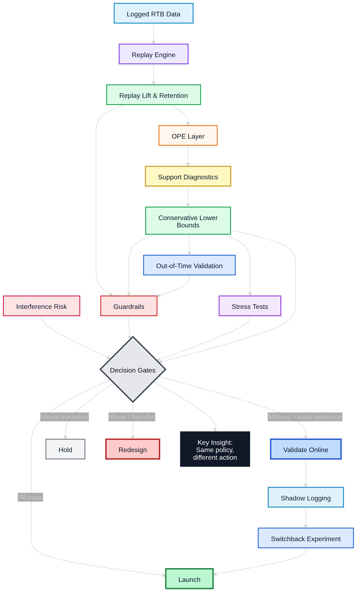

# Marketplace Policies Code

[](LICENSE)
[](pyproject.toml)
[](#reproducibility-boundary)

This repository reproduces the empirical artifacts for the paper:

**From Auction Replay to Launch Readiness: A Decision-Support Framework for Ads Marketplace Policies**

The code is organized as a small, object-oriented Python package. It reads the original local iPinYou archive, rebuilds the bid-opportunity panels and policy-evaluation artifacts, regenerates the paper figures and result tables, validates the decision claims, and creates a clean reproduction bundle that can be archived with the paper or uploaded to GitHub.

<p align="center">
  
</p>

## Pipeline Overview

The repo is built around one reproducibility contract: start from the original local iPinYou data, regenerate the analysis artifacts, and then regenerate the publication outputs.

| Component | Class | Output |
| --- | --- | --- |
| Raw data access | `IpinYouArchive` | Reads bz2 members inside the original iPinYou zip archive |
| Panel construction | `OpportunityPanelBuilder` | Builds season-two and season-three bid-opportunity panels |
| Policy replay | `ReservePolicyCatalog`, `PolicyReplayAnalyzer` | Replays non-decreasing reserve/floor policies |
| Evidence synthesis | `DerivedEvidenceBuilder` | Builds OPE-style diagnostics, validation, scorecards, theory, and ablations |
| Figure generation | `FigureRenderer` | Rebuilds paper-facing diagnostic and validation figures |
| Claim checks | `ResultValidator` | Verifies policy, lift, holdout, ablation, and action claims |
| Full run | `RawToPaperPipeline`, `PaperReproductionPipeline` | Creates analysis artifacts, figures, tables, reports, manifest, and bundle |

## What This Repo Reproduces

The pipeline reproduces the paper-facing results from a local copy of the original iPinYou archive:

- auction price and outcome-density diagnostics
- nuisance-model calibration diagnostics
- reserve/floor replay frontier and daily stability
- season-three out-of-time validation figures
- decision-rule ablation figures
- OPE, support, lower-tail, and sensitivity figures
- launch-readiness and validation-design figures
- paper tables selected by generated `final_table_selection.csv`
- headline decision checks used in the manuscript

No result artifacts are committed. The local `data/` and generated `artifacts/` folders are ignored by Git.

## Repository Layout

```text
marketplace-policies-code/
├── configs/default.toml
├── pyproject.toml
├── README.md
├── scripts/reproduce_paper.py
├── src/marketplace_policies_code/
│   ├── cli.py
│   ├── config.py
│   ├── figures.py
│   ├── pipeline.py
│   ├── raw_pipeline.py
│   ├── repository.py
│   └── results.py
└── tests/
```

## Quick Start

Place the original iPinYou archive here:

```text
data/ipinyou/archive.zip
```

From this folder:

```bash
python -m venv .venv
source .venv/bin/activate
pip install -e ".[dev]"
marketplace-policies reproduce --quick
```

The quick run uses a bounded subset of days and rows so the pipeline can be tested on a laptop. It writes generated analysis artifacts to `artifacts/workspace/` and publication outputs to `artifacts/`.

For paper-scale regeneration, run:

```bash
marketplace-policies reproduce --full
```

The full run reads every available season-two training day and the season-three validation window. It can take a long time and will create large local parquet files under `artifacts/workspace/data/processed/`.

## Commands

Validate headline results only:

```bash
marketplace-policies check --source-root artifacts/workspace
```

Render figures only:

```bash
marketplace-policies figures --source-root artifacts/workspace
```

Export selected paper tables only:

```bash
marketplace-policies tables --source-root artifacts/workspace
```

Build analysis artifacts from raw iPinYou data only:

```bash
marketplace-policies build-artifacts --quick
```

Run the full raw-data-to-paper reproduction:

```bash
marketplace-policies reproduce --full
```

Equivalent script entry point:

```bash
python scripts/reproduce_paper.py --quick
```

## Expected Headline Checks

The `check` command verifies that generated artifacts are internally consistent:

- priority policy: `hybrid_q75_if_gap_100`
- reader-facing name: `Q75 Margin-Gated Floor`
- decision-rule ablation: simplified rules select the same policy but overclaim direct launch
- full DSS action: online validation rather than direct launch

## Data Notes

This repo is designed to be GitHub-friendly:

- full raw and processed iPinYou data are ignored by default
- generated outputs go under `artifacts/`
- no result CSV, parquet, or paper artifacts are committed
- all paper-facing figures and tables are regenerated from local raw data
- external generated artifacts can still be supplied with `--source-root /path/to/artifact/root`

The original iPinYou archive is not redistributed in this repository. Users should obtain it separately and place it under `data/ipinyou/archive.zip`.

## License

This code repository is released under the MIT License. See `LICENSE` for details.

## Development

Run tests:

```bash
pytest
```

Lint:

```bash
ruff check .
```

## Reproducibility Boundary

The package is a raw-data-to-paper reproduction repo. A fresh clone can regenerate the analysis artifacts, figures, selected paper tables, checks, and reports after the user places the original iPinYou archive under `data/ipinyou/archive.zip`. The quick mode is for smoke testing; `--full` is the paper-scale run.
